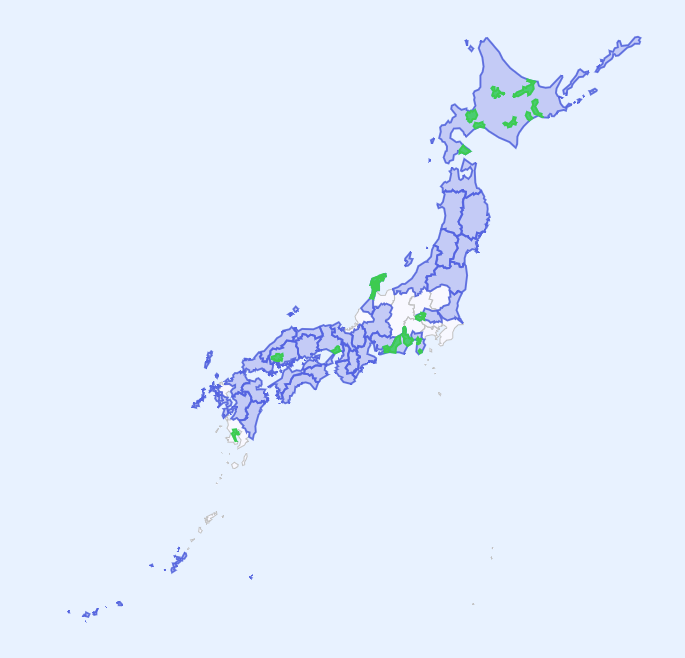

# Mitou-AKATSUKI-Map 令和6年度未踏AKATUSKI事業者マップ

未踏AKATSUKI事業に関するいろんなデータをまとめるためのリポジトリです(現在のところ個人運用)

正式名称 **令和6年度未踏的な地方の若手人材発掘育成事業「AKATSUKIプロジェクト」**

https://mitouteki.jp/

令和6年(2024年)施行事業は 2025年度(令和7年度)をかけて行われます。(混乱しやすいポイント)

システム自体はMITとしていますが、含まれるデータは元のライセンス条項に従います。
(AKATSUKI事業者のリストはライセンスなし(経済産業省IPA公開)、ならびに地図データは国土数値情報の商用利用可能なものを利用しています。)

---

2025年度(令和7年度)の募集地域一覧

